# PM01 Lite 组装说明

## 注意事项
- 1.运动中的电机不可以阻止旋转。
- 2.通电时不可以快速拨动电机。
- 3.正确安装电源，不要将电源短接或接在其他地方。
- 4.焊接或使用工具时请注意安全。

## 物料BOM清单

| 物品 | 数量 | 物品 | 数量 |
| ---- | ---- | ---- | ---- |
| PCB底板 | 1块 | 电机支架 | 2个 |
| 电机 | 2个 | 电机轮子 | 2个 |
| 万向轮 | 1个 | 电池盒 | 1个 |
| 电池组 | 1组 | 巡线模块 | 1个 |
| Arduino nano开发板 | 1块 | XH2.54 6P排线 | 1条 |
| M3短铜柱 | 2个 | M3长柱 | 2个 |
| M3螺丝 | 4个 | M3螺母 | 4个 |
| M2螺丝 | 4个 | M2螺母 | 4个 |
| 螺丝刀 | 一把 |  |  |

    

## 1.电机组装

将M2螺母预埋进电机支架的槽中。

将电机支架使用M2螺丝固定在小车底板上，但不要拧紧。

塞入电机，拧紧，注意保证出轴长度，齿轮箱完全露出。重复上述步骤完成另一侧装配。

将电机上连接的红黑线通过电源灯右侧通孔穿到小车正面，然后将红黑线另一端连接到电源灯上面的排针上。左侧电机线连接到左侧排针；右侧电机线连接到右侧排针，正反随意，若后期写入程序后发现方向不一致再按结果进行调整。

    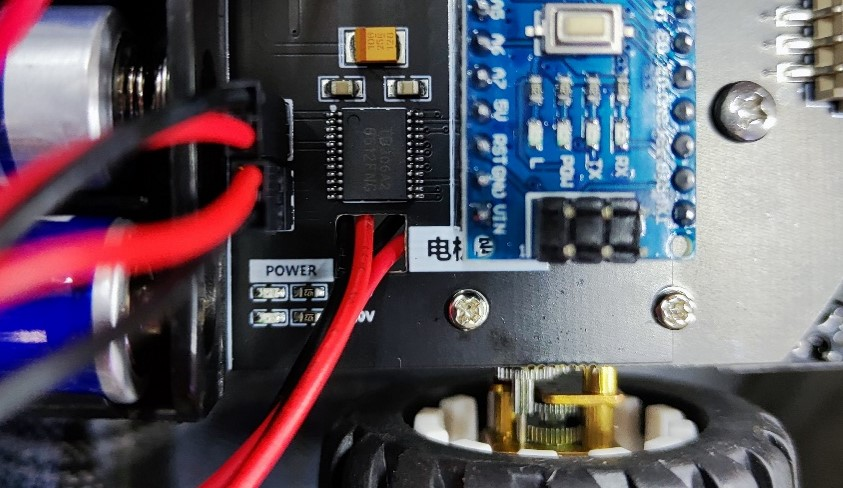

## 2.万向轮组装

将小车底板尾部较近的一行固定孔埋入2颗M3螺丝，背面螺母一侧拧入2颗短铜柱。

    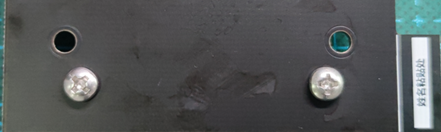
     
    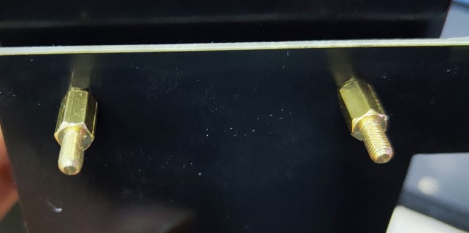

放入万向轮，拧紧螺母，完成装配。

     
    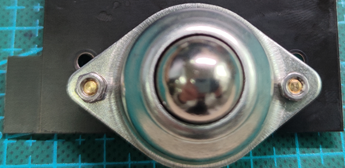

## 3.车轮组装

将车轮对准电机D形轴直接插入，观察小车是否水平。

     
    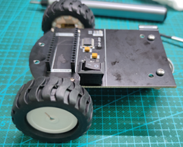

## 4.巡线模块组装

将2个M3	长铜柱塞入固定孔，并在另一侧用M3螺母固定。

    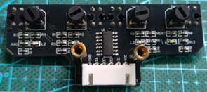
     
    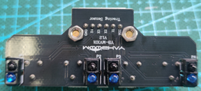

在小车前端预埋两颗M3螺丝，直接旋紧固定即可。

    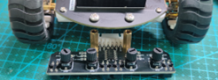
     
    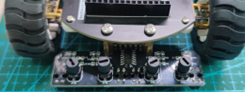

## 5.电池盒组装
撕开电池盒下面的泡沫胶带上面的塑料保护层，然后将电池盒粘在小车后部。

然后，将电池盒红黑线连接到小车船型开关右侧的排针上。**请注意将红线靠近排针上写有“+”的方向**（即红线靠近电池盒，黑线远离电池盒）

    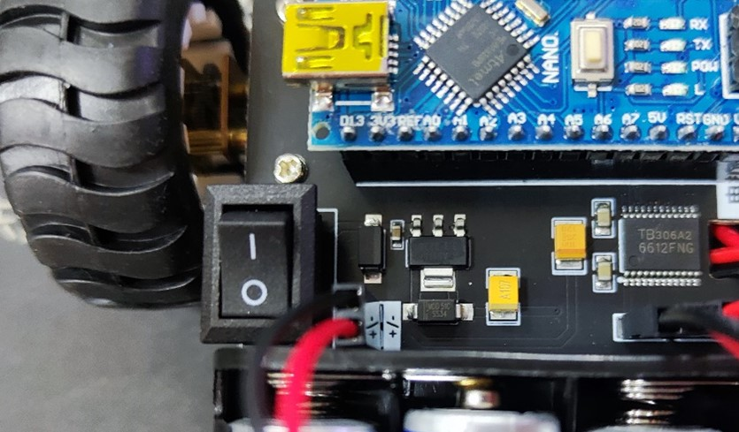

## 6.开发板接入

将Arduino nano核心板插入小车底盘，注意如图安装方向！

    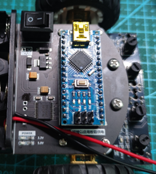

## 7.电源接电

直接将线缆焊接至底板电源输入处，注意区分正负极。此时可以接上电池、按下开关，观察各模块电源灯是否正常亮起。

    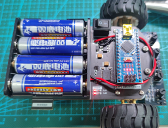

## 8.电机接电

烧入测试程序后打开电源，观察电机的旋转方向，调整电机的线序，保证小车放在地上会向前走。

## 9.传感器接电

接入XH2.54排线，完成组装。

    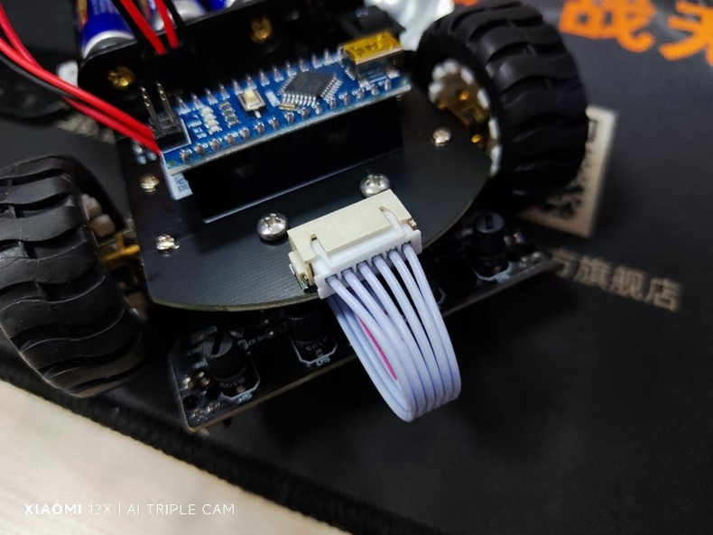

